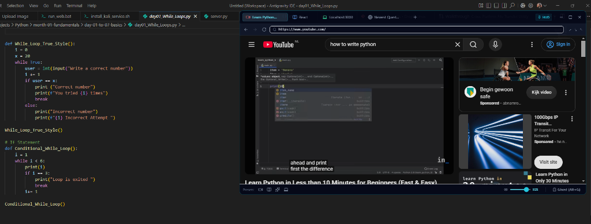
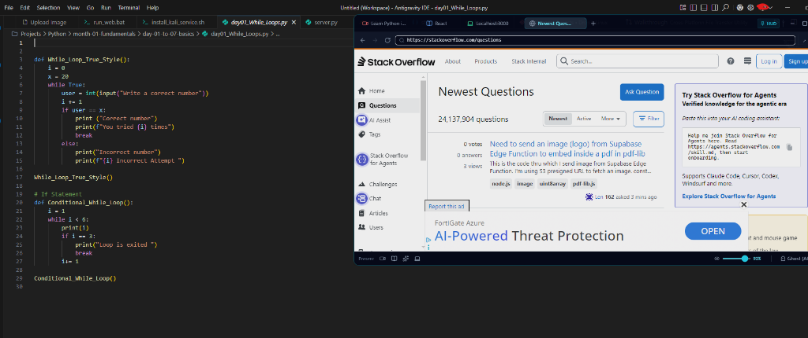

# FloatDeck

A lightweight floating mini-browser built for developers stuck on a single monitor.

If you code on a laptop or a single screen, you know the pain: splitting your screen 50/50 squishes your editor and wraps code awkwardly, while constantly Alt-Tabbing between your editor and a tutorial shatters your flow. Browser PiP doesn't cut it either because you can't click links, read docs, or look at code.

FloatDeck sits on top of your full-screen editor with actual interactive web tabs, an opacity slider, and a click-through ghost mode.

---

## Demos

**Watching a tutorial while coding full-width:**


**Checking Stack Overflow / docs side-by-side:**


---

## What it does

* **Real browser tabs**: Unlike native PiP, this is a full Chromium engine. You can use YouTube, Stack Overflow, React/MDN docs, ChatGPT, or your own `localhost:3000`.
* **Ghost Mode (`Alt + G`)**: Makes the window click-through. Your mouse clicks pass straight through to your IDE or terminal underneath, so you never have to drag the window away just to edit a line of code.
* **Opacity control**: Slider from 15% to 100% so you can peek at whatever is underneath.
* **Always-on-top**: Stays pinned above full-screen windows and IDEs.
* **Corner snapping**: Quick buttons to park it in the top-right, bottom-right, or top-left.

---

## Shortcuts

| Hotkey | What it does |
| --- | --- |
| `Alt + G` | Toggle Ghost Mode (click-through) |
| `Alt + \` | Hide / Show FloatDeck |
| `Ctrl + 1..9` | Switch tabs |

---

## Getting Started

Make sure you have [Node.js](https://nodejs.org/) installed, then:

```bash
# Clone
git clone https://github.com/kiezkiel/FloatDeck-.git
cd FloatDeck-

# Install & run
npm install
npm run dev
```

---

## Built with

* Electron
* React + TypeScript
* Vite + Tailwind CSS

---

## License

MIT
